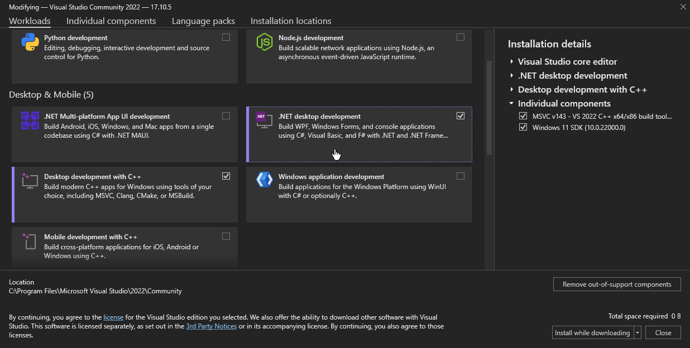

# Wirefetch, a powerful API client

> Wirefetch is a powerful API testing client designed for developers to debug, test, and interact with APIs.

## Building steps

- You must have .NET 8.0 or above & Desktop Development tools to build this project

	

1. Clone the repo with `git clone https://github.com/nazzus/wirefetch.git`
2. CD to the repo path
3. Run `dotnet build` (you can add the `-c Release` flag to enable optimizations)

## TODO
- [x] Request system
- [ ] UI
- [ ] Websockets support
- [ ] Scheduled tasks support
- [ ] JSON / XML parser

## How to Contribute 
We’d love your help to make **Wirefetch** even better! Here’s how you can contribute:

1. **Fork the repository**  
   Clone it to your local machine and develop new features or fixes.  

2. **Submit pull requests**  
   Share your changes by opening a pull request for review.  

3. **Report bugs**  
   Found an issue? Let us know by creating a ticket in the [Issues](https://github.com/nazzus/wirefetch/issues) tab.  

4. **Star the repository**  
   Show your support by starring the repo and sharing it with the community.  

By contributing, you’re helping to build a better tool for developers everywhere. Thank you!
